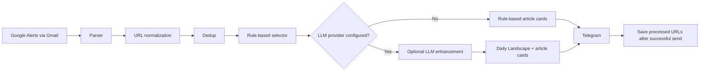

# Google Alerts AI Landscape

Google Alerts AI Landscape summarizes observable patterns across the day's
selected Google Alerts and helps users decide what to read next.

It is a rule-based AI news curation pipeline with optional LLM enhancement. It
does not read full article bodies, forecast the market, or replace the
deterministic selector with a model.

| Layer | Responsibility |
| --- | --- |
| Rule-based selector | Decides which articles to show. |
| LLM enhancer | Explains observable patterns in selected articles. |
| Telegram builder | Delivers a scan-friendly reading-decision brief. |

## What It Does

Google Alerts AI Landscape collects AI-related Google Alerts from Gmail, parses
article metadata, removes known duplicates, selects high-signal articles with a
deterministic rule-based selector, and sends a Telegram brief. When an OpenAI or
NVIDIA Build NIM provider is configured, one optional LLM call adds a grounded
Daily Landscape plus article-level Korean titles, previews, and explanations.

## Why This Project Exists

Google Alerts is useful because it is broad and low-maintenance. It is also
noisy. A single run can contain repeated topics, thin posts, vague headlines,
and articles that are hard to evaluate from the title alone.

This project reduces the time spent deciding what to read. It shows which
patterns are visible in the selected alert batch, then presents the article
links most likely to be worth opening.

## Example Telegram Output

```text
📰 오늘의 AI Landscape

선택된 3개 기사에서 관찰된 패턴입니다.

AI 인프라 투자와 기업용 AI 도입 관련 소식이 함께 나타났습니다.

📌 주요 흐름
• AI 인프라 투자
• 기업 AI 도입

주요 키워드
HBM · GPU · API pricing

주요 기업·기관
NVIDIA · OpenAI · Samsung

━━━━━━━━━━━━━━

🏆 ESSENTIAL
Synthetic example: AI chip suppliers expand HBM capacity for enterprise demand

🇰🇷 AI 반도체 공급 확대

HBM과 GPU 공급 확대가 기업 AI 수요와 함께 언급됐습니다.

이 기사가 보여주는 것
오늘 반복된 AI 인프라 투자 흐름을 보여주는 기사입니다.

🔗 Read →

━━━━━━━━━━━━━━

✅ RECOMMENDED
Synthetic example: enterprise AI platform updates API pricing

🇰🇷 기업 AI API 가격 변화

API pricing과 enterprise customer rollout이 함께 나타났습니다.

이 기사가 보여주는 것
기업용 AI 도입과 비용 변화가 같은 배치에서 관찰됩니다.

🔗 Read →
```

The Landscape describes only the selected Google Alerts batch. It is not a claim
about the whole AI market.

## Product Principles

- Reading Decision First: help the user decide what to open.
- Patterns Before Articles: show repeated batch-level patterns before links.
- Rule-based Decides: deterministic selection owns article inclusion.
- Observable, Not Predictive: describe what is present, not what will happen.
- Adaptive Intelligence: hide sections that are not grounded.
- Graceful Degradation: fall back to rule-based cards when LLM output fails.
- Cost is a Product Feature: keep the pipeline cheap and bounded.

Detailed references:

- [Design Principles](docs/DESIGN_PRINCIPLES.md)
- [Message Specification](docs/MESSAGE_SPECIFICATION.md)
- [Architecture](docs/ARCHITECTURE.md)

## Pipeline



Runtime sequence:

1. GitHub Actions or local execution runs `python -m src.main`.
2. Gmail IMAP fetches recent Google Alerts HTML emails.
3. The parser extracts title, source, URL, and snippet.
4. URLs are normalized and deduplicated.
5. `DedupStore` filters URLs already processed in previous successful sends.
6. `select_high_signal_articles` selects the final article set.
7. Optional LLM enhancement generates Daily Landscape and article fields.
8. `build_telegram_message` renders the Telegram brief.
9. URLs are saved as processed only after Telegram send succeeds.

## Rule-Based First, LLM Second

The selector is deterministic and runs before any LLM call. The LLM receives
only selected articles and cannot add, remove, merge, hide, or reorder them.

If no provider is configured, the message still works as a rule-based Telegram
brief. If the LLM fails, returns malformed JSON, or produces unusable fields,
production falls back to the selected rule-based articles.

Semantic deduplication is disabled in the current release. The pipeline uses
deterministic URL deduplication and processed URL state instead.

The system does not fetch or read full article bodies. LLM input is limited to
title, source, snippet, and rule-based reasons.

## Daily Landscape

Today's AI Landscape means observable repeated patterns in the selected Google
Alerts articles from the current run.

Validated fields:

| Field | Purpose |
| --- | --- |
| `headline` | One short batch-level observation. |
| `themes` | Repeated topic groups supported by multiple selected articles. |
| `keywords` | Source-grounded terms that help recognition. |
| `entities` | Source-grounded companies, institutions, products, or models. |

Each field is hidden when empty or invalid. The message does not force a
Landscape when the selected articles do not support one.

## Article Cards

Article cards keep the reading decision close to the source link.

| Field | Purpose |
| --- | --- |
| Original title | Preserve the source headline exactly as parsed. |
| Korean supporting title | Provide a short Korean reading aid when available. |
| Preview | Give a grounded one-sentence clue from title/snippet evidence. |
| Article-to-landscape explanation | Explain what the article shows in the current batch. |
| Source link | Let the user open the original article. |

`confidence` and `evidence` are internal validation fields. They are not shown
in Telegram.

## Provider Support

Supported optional LLM providers:

- OpenAI
- NVIDIA Build NIM

Current RC1 operation uses NVIDIA Build NIM with Mistral Medium 3.5 through the
repository variable:

```text
NVIDIA_MODEL=mistralai/mistral-medium-3.5-128b
```

The project is not tied to one model. `src/config.py` still contains a MiniMax
default for NVIDIA when `NVIDIA_MODEL` is omitted; the production workflow passes
the repository variable value.

## Configuration

### GitHub Repository Secrets

Production requires:

| Secret | Purpose |
| --- | --- |
| `GMAIL_EMAIL` | Gmail account receiving Google Alerts. |
| `GMAIL_APP_PASSWORD` | Gmail app password for IMAP. |
| `TELEGRAM_BOT_TOKEN` | Telegram bot token. |
| `TELEGRAM_CHAT_ID` | Telegram target chat. |
| `NVIDIA_API_KEY` or `OPENAI_API_KEY` | LLM provider credential when enhancement is enabled. |

### GitHub Repository Variables

Recommended NVIDIA operation:

| Variable | Example |
| --- | --- |
| `LLM_PROVIDER` | `nvidia` |
| `NVIDIA_MODEL` | `mistralai/mistral-medium-3.5-128b` |
| `NVIDIA_TIMEOUT_SECONDS` | `60` |
| `NVIDIA_BASE_URL` | Optional; defaults to `https://integrate.api.nvidia.com/v1`. |

OpenAI operation:

| Variable or Secret | Example |
| --- | --- |
| `LLM_PROVIDER` | `openai` |
| `OPENAI_API_KEY` | GitHub Repository Secret |
| `OPENAI_MODEL` | Optional variable; defaults to `gpt-4.1-mini`. |

If `LLM_PROVIDER` is empty but `OPENAI_API_KEY` is present, `src/config.py`
defaults to the OpenAI provider. Disabled values include `none`, `off`,
`rule_based`, and `rule-based`.

The main production workflow maps provider settings from repository variables
and credentials from repository secrets.

## Local Setup

The GitHub Actions workflows use Python 3.11. Local development should use a
modern Python 3 environment.

```bash
python3 -m venv .venv
source .venv/bin/activate
python3 -m pip install -r requirements.txt
```

Set the required runtime environment:

```bash
export GMAIL_EMAIL="your-email@gmail.com"
export GMAIL_APP_PASSWORD="your-gmail-app-password"
export TELEGRAM_BOT_TOKEN="your-telegram-bot-token"
export TELEGRAM_CHAT_ID="your-telegram-chat-id"
```

Optional NVIDIA enhancement:

```bash
export LLM_PROVIDER="nvidia"
export NVIDIA_API_KEY="your-nvidia-api-key"
export NVIDIA_MODEL="mistralai/mistral-medium-3.5-128b"
export NVIDIA_TIMEOUT_SECONDS="60"
```

Optional OpenAI enhancement:

```bash
export LLM_PROVIDER="openai"
export OPENAI_API_KEY="your-openai-api-key"
export OPENAI_MODEL="gpt-4.1-mini"
```

Run locally:

```bash
python3 -m src.main
```

## GitHub Actions

### Production Workflow

Workflow: `.github/workflows/google-alerts-curator.yml`

- Runs on `0 0 * * *` UTC, which is 09:00 KST.
- Supports manual `workflow_dispatch`.
- Uses Python 3.11.
- Installs dependencies and runs tests before production execution.
- Accesses Gmail IMAP.
- Sends a real Telegram message.
- Saves processed URL state only after successful Telegram delivery.

### NVIDIA Smoke Test

Workflow: `.github/workflows/nvidia-smoke-test.yml`

- Manual `workflow_dispatch` only.
- Uses synthetic fixtures.
- Does not access Gmail.
- Does not mutate dedup state.
- Runs strict LLM diagnostics.
- Sends a Telegram message with a smoke-test prefix.

## Testing

Run the full test suite:

```bash
python3 -m pytest
```

For bytecode-free CI-style local checks:

```bash
PYTHONDONTWRITEBYTECODE=1 python3 -m pytest -p no:cacheprovider
```

## Limitations

- The pipeline does not read full article bodies.
- Output quality depends on Google Alerts title and snippet quality.
- Daily Landscape describes selected-batch patterns, not the whole AI market.
- The selector limit affects what can appear in the message.
- Google Alerts coverage and ranking introduce source bias.
- This is single-run batch analysis, not long-term trend analysis.
- Some person/company/event-style headlines may omit the Korean supporting
  title; see [Known Issues](docs/KNOWN_ISSUES.md).

## Non-Goals

- Full article scraping.
- Paywall bypass.
- Market prediction.
- Investment advice.
- Career advice.
- Semantic deduplication in the current release.
- Dashboard or multi-user SaaS features.

## Documentation

- [Design Principles](docs/DESIGN_PRINCIPLES.md)
- [Message Specification](docs/MESSAGE_SPECIFICATION.md)
- [Architecture](docs/ARCHITECTURE.md)
- [Known Issues](docs/KNOWN_ISSUES.md)
- [RC1 Checklist](docs/RELEASE_CHECKLIST_RC1.md)

Repository rename and GitHub metadata guidance:

- [GitHub Repository Setup](docs/GITHUB_REPOSITORY_SETUP.md)

## Security Notes

- Never commit secrets, tokens, app passwords, or API keys.
- Use a Gmail app password; do not use the normal Gmail account password.
- Do not print Telegram, NVIDIA, OpenAI, or Gmail credentials in logs.
- Dedup state stores processed URL hashes, not raw article bodies.
- Do not dump full emails, full prompts, or full LLM responses into logs.
