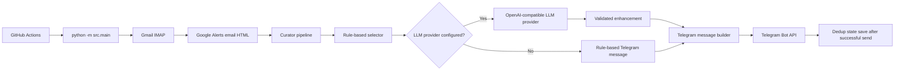
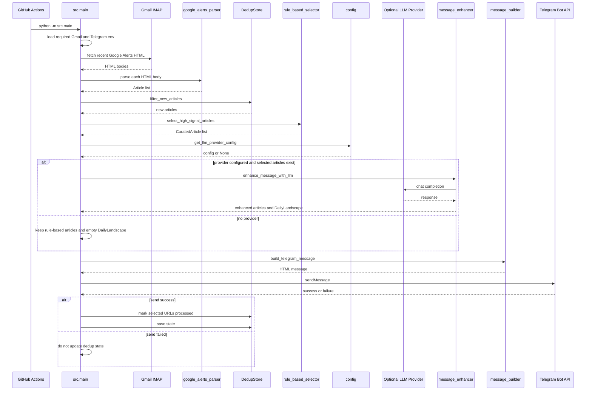

# Google Alerts AI Curator 2.0 Architecture

## 1. Purpose

This document explains how Google Alerts AI Curator 2.0 is structured at
runtime.

It connects:

- `docs/DESIGN_PRINCIPLES.md` to concrete module boundaries.
- `docs/MESSAGE_SPECIFICATION.md` to the actual message-building flow.
- The rule-based selector to the optional LLM enhancement layer.
- GitHub Actions operation to local Python modules.

This is not a README and not a prompt guide. It is the architecture boundary for
future changes. New features should preserve the split between deterministic
selection and grounded generation unless the product explicitly changes that
decision.

## 2. System Context

Google Alerts AI Curator runs as a small scheduled pipeline. GitHub Actions
starts the process, Gmail provides Google Alerts email HTML, Python modules parse
and select articles, an optional OpenAI-compatible LLM provider enhances the
message, and Telegram receives the final reading-decision card.

External systems:

- Gmail IMAP.
- Google Alerts email.
- OpenAI API.
- NVIDIA Build NIM API.
- Telegram Bot API.
- GitHub Actions.

Internal systems:

- Gmail fetcher.
- Google Alerts parser.
- URL normalizer.
- Dedup store.
- Rule-based selector.
- Provider config.
- Message enhancer.
- Response normalization and validation layer.
- Message builder.
- Telegram sender.

High-level context:

The optional LLM path is intentionally downstream of deterministic selection.
The LLM is never the article inclusion authority in the active `src.main`
runtime flow.

## 3. Architectural Goals

| Goal | Structural expression |
| --- | --- |
| Reading Decision support | `message_builder` renders compact article cards with title, optional Korean title, preview, why-selected reason, and source link. |
| Observable Pattern Synthesis | `message_enhancer` can return `DailyLandscape` fields derived from selected article metadata. |
| Rule-based first | `select_high_signal_articles` runs before any LLM enhancement. |
| Optional LLM enhancement | `get_llm_provider_config` returns `None` when no usable provider is configured; runtime then uses rule-based output. |
| Graceful degradation | `enhance_message_with_llm` returns original articles and an empty `DailyLandscape` on operational failures when `raise_on_error=False`. |
| One-call LLM design | The prompt asks for landscape and article enhancement in one chat completion request. |
| Cost-aware execution | The selector caps selected articles at a default limit of 3 before the LLM sees the batch. |
| Grounded output | Parser and validators remove unsupported preview, evidence, landscape terms, broad themes, and invalid indices. |
| Provider portability | OpenAI and NVIDIA are both configured through `LLMProviderConfig` and an OpenAI-compatible client interface. |
| Testability | Main orchestration, selector, parser, dedup store, message builder, provider config, and smoke test each have unit coverage. |
| Operational diagnosability | NVIDIA smoke test uses strict mode and logs response metadata without printing secrets or full prompts. |

## 4. End-to-End Runtime Flow

The active production entry point is `src/main.py`.

Numbered flow:

1. GitHub Actions triggers `.github/workflows/google-alerts-curator.yml` by
   schedule or manual `workflow_dispatch`.
2. The workflow checks out the repository, installs dependencies, runs
   `python -m pytest`, then runs `python -m src.main`.
3. `src.main._load_required_env` requires Gmail and Telegram credentials:
   `GMAIL_EMAIL`, `GMAIL_APP_PASSWORD`, `TELEGRAM_BOT_TOKEN`, and
   `TELEGRAM_CHAT_ID`.
4. `fetch_recent_google_alerts_html` connects to Gmail IMAP over SSL and fetches
   recent HTML email bodies.
5. `parse_google_alerts_email` parses each HTML body into `Article` objects:
   title, source, URL, and snippet.
6. `normalize_url` unwraps supported Google redirect URLs and removes known
   tracking query parameters.
7. The parser performs email-level URL deduplication with a `seen_urls` set.
8. `DedupStore.filter_new_articles` removes URLs already saved in
   `data/processed_urls.json` as SHA-256 URL hashes.
9. `select_high_signal_articles` scores the remaining articles and returns up
   to the configured limit, currently defaulting to 3.
10. `get_llm_provider_config` resolves optional OpenAI or NVIDIA provider
    configuration.
11. If a provider config exists and selected articles exist, `src.main` calls
    `enhance_message_with_llm`.
12. The enhancer builds one prompt containing selected article metadata and
    calls the OpenAI-compatible chat completion API.
13. `_extract_response_text` separates API response extraction from parsing and
    collects safe diagnostics.
14. `_strip_markdown_code_fence` accepts only full-response JSON fences before
    `json.loads`.
15. `parse_message_enhancement_response` parses strict JSON, preserves article
    count and order, and validates article fields and landscape fields.
16. On operational LLM failure, malformed response, empty usable output, or
    missing client, production falls back to original curated articles and an
    empty `DailyLandscape`.
17. `build_telegram_message` renders `DailyLandscape` when non-empty, otherwise
    falls back to legacy daily trends or the header, then renders article cards.
18. `send_telegram_message` sends the HTML-formatted message to Telegram with
    web previews disabled.
19. Only after Telegram send succeeds, `src.main` marks the selected article
    URLs as processed and calls `DedupStore.save`.

Sequence view:

## 5. Core Processing Pipeline

### 5.1 Ingestion

Module: `src/gmail_fetcher.py`.

`fetch_recent_google_alerts_html` connects to `imap.gmail.com` using
`imaplib.IMAP4_SSL`. It searches the last 24 hours by default. The first search
targets `googlealerts-noreply@google.com`; if that returns no messages, the
fetcher falls back to a broader recent-message search.

Input limitations:

- Gmail must be reachable.
- Gmail credentials must be valid.
- The project only uses HTML email bodies.
- Google Alerts content quality is outside the system's control.
- The pipeline does not fetch full article bodies.

Network failures are not deeply handled in `src.main`; if Gmail access raises an
exception, the run fails rather than producing a partial message.

### 5.2 Parsing and Normalization

Modules: `src/google_alerts_parser.py`, `src/url_normalizer.py`.

The parser:

- Reads HTML with BeautifulSoup.
- Iterates anchor tags.
- Skips Google account, alert management, social sharing, unsubscribe, mailto,
  and URL-text-only links.
- Normalizes each URL.
- Deduplicates repeated normalized URLs inside a single email body.
- Extracts snippets from `itemtype="http://schema.org/Article"` containers and
  `itemprop="description"`.
- Splits title and source with `" - "`.
- Falls back to `" | "` source suffix splitting only for known pipe-suffix
  sources such as Reuters, Bloomberg, CNBC, Financial Times, The Economist, and
  The New York Times.

The normalizer:

- Accepts `http` and `https` URLs.
- Unwraps Google redirect targets from `url`, `q`, or `u` query parameters.
- Removes known tracking parameters such as `utm_*`, `gclid`, and `fbclid`.
- Trims trailing path slashes except for `/`.

Malformed or irrelevant input is skipped rather than repaired aggressively.

### 5.3 Deduplication

Deduplication happens in two deterministic layers.

| Layer | Location | Scope | Mechanism |
| --- | --- | --- | --- |
| Email-level URL dedup | `parse_google_alerts_email` | One HTML email body | `seen_urls` set of normalized URLs. |
| Processed URL dedup | `DedupStore` | Cross-run state | SHA-256 hash of normalized URL in `data/processed_urls.json`. |

Semantic deduplication is disabled for this release. That decision aligns with
the product principle that the rule-based selector owns article inclusion and
the LLM must not remove, merge, hide, or reorder articles. URL and processed
state dedup are deterministic, explainable, and cheap. Semantic dedup would
introduce a new decision layer that can silently collapse articles and weaken
testability.

State safety boundary:

- `src.main` keeps `articles_to_mark_processed = curated_articles` immediately
  after rule-based selection.
- The dedup store marks and saves those selected URLs only after Telegram send
  succeeds.
- If Telegram send fails, processed state is not updated.

### 5.4 Rule-Based Selection

Module: `src/rule_based_selector.py`.

`select_high_signal_articles` is the decision owner. It scores `Article` objects
and returns `CuratedArticle` objects when score is at least 4. It sorts by score
descending and returns up to `limit`, currently defaulting to 3.

Signals include:

- Trusted source scores.
- Title boosts.
- Event type categories such as pricing, infrastructure investment,
  semiconductor supply chain, regulation, developer ecosystem, enterprise
  adoption, security, product/platform strategy, and funding or M&A.
- Signal categories such as platform shift, infrastructure, ecosystem
  competition, enterprise adoption, regulation, semiconductor, and interface
  shift.
- Low-value penalties for viral, listicle, fear, culture-war, job-panic,
  rumor, stock-promotion, coupon, review, and sensational patterns.
- Question-headline penalty.

The selector also produces:

- `relevance_score`.
- `why_selected`.
- `recommendation_reasons`.
- Legacy `korean_summary` and `career_market_insight` fields on
  `CuratedArticle`.

Architectural boundary:

- Rule-based logic is the decision owner.
- LLM enhancement is the explanation and synthesis owner.
- The LLM may improve wording and synthesize visible patterns, but it must not
  decide which articles are included.

### 5.5 Adaptive LLM Gate

The current implementation and target 2.0 policy are not identical. The
architecture should keep them distinct.

Current behavior in `src.main`:

| Condition | LLM call | Landscape | Article enhancement |
| --- | ---: | ---: | ---: |
| No provider config | No | No | Rule-based only |
| 0 selected articles | No | No | No |
| 1 selected article and provider config exists | Yes | Parser may return empty landscape | Attempted |
| 2 selected articles and provider config exists | Yes | Parser may return landscape if valid | Attempted |
| 3 selected articles and provider config exists | Yes | Attempted | Attempted |
| LLM fails in production mode | Attempted | No | Rule-based fallback |

Target v2 policy from `docs/MESSAGE_SPECIFICATION.md`:

| Condition | LLM call | Landscape | Article enhancement |
| --- | ---: | ---: | ---: |
| 0 articles | No | No | No |
| 1-2 selected articles | No in target v2 policy | No | Rule-based only |
| 3+ selected articles | Yes | Attempt | Yes |
| LLM returns empty landscape | Yes | Hidden | Enhanced articles may remain |
| LLM fails | Attempted | No | Rule-based fallback |

The code currently gates on provider config and non-empty selected articles, not
on `len(curated_articles) >= 3`. Future implementation work is required if the
target policy should become runtime behavior.

### 5.6 LLM Enhancement and Validation

Module: `src/message_enhancer.py`.

The enhancer performs one LLM call for both:

- Daily Landscape.
- Article-level enhancement.

Prompt input includes only selected article metadata:

- index.
- title.
- source.
- snippet.
- rule-based reasons.

The response parser expects JSON shaped around:

- `landscape`.
- `articles`.

Article validation:

- Preserves original article count and order by mapping enhancements by input
  index.
- Ignores invalid, duplicate, out-of-range, or missing indices.
- Falls back to the original article when an index has no usable enhancement.
- Cleans Korean title by type and length.
- Allows preview only when confidence is not low and evidence is grounded.
- Filters evidence to strings present in the original title or snippet.
- Removes previews containing forbidden investment, career, or generic advice
  phrases.
- Normalizes invalid confidence to low.

Landscape validation:

- Non-dict landscape becomes empty `DailyLandscape`.
- Headline must be a string, length-limited, and removed when article count is
  below 2.
- Forbidden predictive or advice-like landscape phrasing removes headline.
- Themes must be a list of dicts.
- Theme labels are type- and length-checked and cannot be broad labels such as
  `AI`, `technology`, or `industry`.
- Theme indices must be integer, unique, and within input range.
- Themes with fewer than two valid article indices are removed.
- Themes are capped at 4.
- Keywords are capped at 6.
- Entities are capped at 5.
- Keywords and entities must appear in selected article titles or snippets using
  case-insensitive matching.
- Duplicate, plural-equivalent, and broad terms are removed.

JSON normalization boundary:

- `_strip_markdown_code_fence` removes only full-response fenced JSON in
  `json`-tagged or plain Markdown code-fence form.
- The parser does not extract JSON from prose.
- The parser does not repair missing commas, trailing commas, schema errors, or
  malformed JSON.

Strict diagnostics boundary:

- Production calls use `raise_on_error=False`, so failures fall back.
- Smoke tests use `raise_on_error=True`, so failure stages become explicit.

## 6. LLM Provider Architecture

Modules: `src/config.py`, `src/message_enhancer.py`.

`get_llm_provider_config` returns an `LLMProviderConfig` or `None`.

Provider behavior:

| Provider state | Behavior |
| --- | --- |
| `LLM_PROVIDER` empty and `OPENAI_API_KEY` present | Uses OpenAI by default. |
| `LLM_PROVIDER` empty and no `OPENAI_API_KEY` | LLM disabled. |
| `LLM_PROVIDER` in `none`, `off`, `rule_based`, `rule-based` | LLM disabled. |
| `LLM_PROVIDER=openai` and missing `OPENAI_API_KEY` | LLM disabled. |
| `LLM_PROVIDER=nvidia` and missing `NVIDIA_API_KEY` | LLM disabled. |
| Unknown provider | LLM disabled. |

Provider configuration:

| Variable | Runtime use | Default | Main workflow source | Smoke workflow source |
| --- | --- | --- | --- | --- |
| `LLM_PROVIDER` | Selects provider or disabled mode. | Empty, then OpenAI if `OPENAI_API_KEY` exists. | Secret | Variable |
| `OPENAI_API_KEY` | Required for OpenAI provider. | None | Secret | Not used |
| `OPENAI_MODEL` | OpenAI model. | `gpt-4.1-mini` | Secret | Not used |
| `NVIDIA_API_KEY` | Required for NVIDIA provider. | None | Secret | Secret |
| `NVIDIA_BASE_URL` | OpenAI-compatible NVIDIA base URL. | `https://integrate.api.nvidia.com/v1` | Secret | Not passed; default applies |
| `NVIDIA_MODEL` | NVIDIA model. | `minimaxai/minimax-m3` | Secret | Variable |
| `NVIDIA_TIMEOUT_SECONDS` | Provider timeout. | `60.0` | Not passed; default applies | Variable |
| `NVIDIA_MAX_TOKENS` | Not read by current code. | Not applicable | Not passed | Not passed |
| `SUMMARY_PROVIDER` | Not read by current code. | Not applicable | Not passed | Not passed |

Completion kwargs:

| Provider/model | Completion kwargs |
| --- | --- |
| OpenAI provider | No model-specific kwargs from `_build_completion_kwargs`. |
| NVIDIA common path | `max_tokens=2048`, `temperature=0.2`, `stream=False`. |
| `minimaxai/minimax-m3` | NVIDIA common kwargs plus `extra_body.chat_template_kwargs.thinking_mode="disabled"`. |
| Mistral or other NVIDIA model | NVIDIA common kwargs only; no MiniMax `extra_body`. |

The current default NVIDIA model remains `minimaxai/minimax-m3` in
`src/config.py`, but the smoke test no longer requires that specific model. A
repository variable can provide another non-empty NVIDIA model for the smoke
workflow.

## 7. Message Construction Architecture

Module: `src/message_builder.py`.

`build_telegram_message` receives selected or enhanced `CuratedArticle` objects
and an optional `DailyLandscape`.

Rendering order:

1. If `landscape` is non-empty, render `오늘의 AI Landscape`.
2. Else, if legacy `daily_trends` is present, render `오늘의 AI 흐름`.
3. Else, render the header.
4. Render each article card.
5. Join sections with `━━━━━━━━━━━━━━`.

Landscape rendering:

- Header: `오늘의 AI Landscape`.
- Optional headline.
- Optional `주요 흐름` list from theme labels.
- Optional `주요 키워드` line joined with ` · `.
- Optional `주요 기업·기관` line joined with ` · `.
- Theme summaries are not displayed in Telegram.

Article rendering:

- Tier from relevance score:
  - `ESSENTIAL` for score >= 20.
  - `RECOMMENDED` for score >= 8.
  - `WORTH A LOOK` otherwise.
- Original title.
- Optional Korean title.
- Optional preview when confidence is not low.
- Enhanced why-selected text, or fallback reader-facing rule-based reasons.
- Source link using Telegram HTML.

Escaping:

- Text uses `html.escape(..., quote=False)`.
- Link URL attributes use `html.escape(..., quote=True)`.
- Telegram sender uses `parse_mode="HTML"`.

The message builder hides empty sections instead of generating filler text.

## 8. Data Model

Module: `src/models.py`.

| Model | Purpose |
| --- | --- |
| `Article` | Parsed Google Alerts input: title, source, URL, snippet. |
| `CuratedArticle` | Rule-based selected article plus optional enhancement fields. |
| `TrendTheme` | A landscape theme with label, article indices, and internal summary. |
| `DailyLandscape` | Optional top-level message orientation: headline, themes, keywords, entities. |

`DailyLandscape.is_empty` is the message-builder gate for showing or hiding the
landscape section.

The model design keeps article enhancement fields on `CuratedArticle` while
keeping batch-level synthesis in `DailyLandscape`. This prevents landscape
concerns from becoming hidden per-article selection logic.

## 9. Workflow Architecture

### 9.1 Main Curator Workflow

File: `.github/workflows/google-alerts-curator.yml`.

Triggers:

- Daily cron at `0 0 * * *`, documented as 09:00 KST.
- Manual `workflow_dispatch`.

Job behavior:

1. Runs on `ubuntu-latest`.
2. Sets Gmail, LLM, NVIDIA, OpenAI, and Telegram environment variables.
3. Checks out the repository.
4. Sets up Python 3.11.
5. Installs `requirements.txt`.
6. Runs `python -m pytest`.
7. Runs `python -m src.main`.

The workflow treats tests as a release gate before production execution.

### 9.2 NVIDIA Smoke Test Workflow

File: `.github/workflows/nvidia-smoke-test.yml`.

Trigger:

- Manual `workflow_dispatch`.

Job behavior:

1. Runs on `ubuntu-latest`.
2. Has `timeout-minutes: 5`.
3. Uses repository variables for `LLM_PROVIDER`, `NVIDIA_MODEL`, and
   `NVIDIA_TIMEOUT_SECONDS`.
4. Uses secrets for `NVIDIA_API_KEY`, `TELEGRAM_BOT_TOKEN`, and
   `TELEGRAM_CHAT_ID`.
5. Runs `python scripts/smoke_test_nvidia_enhancer.py`.

The smoke test intentionally does not access Gmail and does not use dedup state.
It creates synthetic fixture articles, runs rule-based selection, calls the
NVIDIA provider in strict mode, validates article count preservation, builds a
Telegram message with `[SMOKE TEST]` prefix, and sends it to Telegram.

Smoke diagnostics include:

- Provider and model.
- Rule-based selected article count.
- LLM enhancement success.
- Preview generated and omitted counts.
- Landscape headline presence.
- Theme, keyword, and entity counts.
- Telegram send success.
- LLM error stage, type, and message when present.
- Response object type, model, choices count, finish reason, content type,
  content length, reasoning-content presence, and safe response keys.

Secret safety:

- Diagnostic text is sanitized in `message_enhancer`.
- Smoke logs print counts and metadata, not full prompts.
- Tests assert that secrets are not exposed in smoke logs.

## 10. Operational Reliability Boundaries

The system uses several explicit failure boundaries.

| Boundary | Runtime behavior |
| --- | --- |
| Missing required Gmail or Telegram env | `src.main` prints missing names and exits. |
| No recent Gmail HTML | Prints no recent emails and exits. |
| No parsed articles | Prints no parsed articles and exits. |
| No new articles after dedup | Prints no new articles and exits. |
| No high-signal selected articles | Prints no high-signal articles and exits. |
| LLM disabled | Builds rule-based message. |
| LLM operational failure | Returns original selected articles and empty landscape. |
| LLM strict smoke failure | Raises diagnostic error and fails smoke test. |
| Empty Telegram message | Exits without send. |
| Telegram send failure | Does not save processed state. |
| Telegram send success | Saves processed URL hashes. |

This reliability model favors delivery of a grounded deterministic message over
dependency on optional generation.

## 11. Cost and Performance Boundaries

The cost-aware design is structural:

- Gmail and Google Alerts are free-first inputs.
- Rule-based selection happens before any LLM call.
- Default selected article limit is 3.
- The LLM prompt includes selected metadata only, not full article bodies.
- Landscape and article enhancement share one LLM call.
- No embedding store, vector database, crawler, browser automation, or external
  search is part of the current architecture.
- NVIDIA smoke test is manual, not scheduled.

The main runtime still calls the LLM for 1 or 2 selected articles when a provider
is configured. That differs from the target v2 adaptive policy and is a known
architecture gap if cost minimization should become stricter.

## 12. Explainability Boundaries

The architecture keeps decision ownership explainable:

- URL normalization explains why duplicate links collapse.
- Processed URL hashes explain why previously sent links are skipped.
- Rule-based scores explain why articles are selected.
- Recommendation reasons explain the deterministic signal.
- LLM-generated text is post-validated and can be hidden field by field.
- The source link remains visible so the user can inspect the original article.

The LLM is not allowed to create hidden article inclusion decisions. This keeps
the system inspectable in tests and in production failures.

## 13. Active and Legacy LLM Paths

Active runtime path:

- `src.main` uses `select_high_signal_articles`.
- `src.main` optionally calls `enhance_message_with_llm`.
- `message_enhancer` performs message enhancement and landscape generation.

Legacy path:

- `src/curator.py` still contains an older LLM-based curation flow with
  `build_curator_prompt`, `parse_curator_response`, and `curate_articles`.
- Tests still cover that module.
- `src.main` does not call `src.curator.curate_articles`.

Architecture implication:

- New 2.0 work should treat `message_enhancer` as the active LLM enhancement
  path.
- `src.curator.py` should not be used as evidence that LLM selection is part of
  the current production runtime.

## 14. Testability Map

The test suite covers the architecture through module-level and flow-level
tests.

| Area | Test focus |
| --- | --- |
| Gmail fetcher | HTML extraction and search behavior. |
| Google Alerts parser | Link filtering, snippet extraction, source splitting, URL dedup. |
| URL normalizer | Redirect unwrapping and tracking parameter removal. |
| Dedup store | Hash loading, filtering, saving, malformed state handling. |
| Rule-based selector | Scores, signals, penalties, limits, recommendation reasons. |
| Provider config | OpenAI, NVIDIA, defaults, disabled providers, timeout parsing. |
| Message enhancer | Prompt constraints, response extraction, fenced JSON, validation, fallback, strict diagnostics, provider kwargs. |
| Message builder | Landscape rendering, hidden sections, article cards, escaping. |
| Main flow | Env handling, provider wiring, LLM fallback, Telegram send, dedup save timing. |
| NVIDIA smoke test | Fixture selection, strict enhancer call, model neutrality, diagnostics, secret masking, Telegram send. |

This test structure mirrors the architecture boundaries and helps prevent the
LLM layer from leaking into selection, dedup, or delivery state.

## 15. Architecture Decisions and Trade-offs

### 15.1 Google Alerts Instead of Crawling

Decision:

- Use Google Alerts email as the discovery input.

Trade-off:

- Lower infrastructure cost and simpler operation.
- Less control over source quality and snippet completeness.

Architecture response:

- Keep output honest about metadata-only evidence.
- Do not claim full article understanding.

### 15.2 URL Dedup Instead of Semantic Dedup

Decision:

- Use deterministic URL-level dedup and processed-state dedup.
- Keep semantic dedup disabled.

Trade-off:

- Near-duplicate stories may both appear.
- The system avoids opaque article removal.

Architecture response:

- LLM prompt explicitly says not to remove, merge, hide, or reorder articles.
- Article count preservation is smoke-tested.

### 15.3 Rule-Based Selection Before LLM

Decision:

- Select articles before any LLM call.

Trade-off:

- The selector may miss subtle relevance that a model could infer.
- Selection remains explainable, cheap, and stable.

Architecture response:

- Use LLM for wording and pattern synthesis only.
- Keep selector scoring deterministic and testable.

### 15.4 One LLM Call

Decision:

- Generate landscape and article enhancement in one request.

Trade-off:

- Prompt complexity increases.
- Runtime and provider cost stay lower than multi-call designs.

Architecture response:

- Validate landscape and article fields independently.
- Hide invalid optional sections rather than failing the whole message.

### 15.5 Production Fallback, Smoke Strictness

Decision:

- Production uses non-strict enhancement fallback.
- Smoke test uses strict diagnostics.

Trade-off:

- Production may silently deliver rule-based output when LLM fails.
- Smoke test catches provider and parser issues explicitly.

Architecture response:

- Keep smoke logs focused on metadata and counts.
- Keep production delivery independent from optional LLM success.

## 16. Future Architecture Boundaries

Allowed near-term evolution:

- Enforce target v2 adaptive gate in runtime if desired.
- Improve deterministic keyword and entity validation.
- Improve Telegram length budgeting.
- Align README examples with Message Specification.
- Add tests that compare current behavior to target policy before changing
  runtime gates.

Requires explicit architecture decision:

- Article body fetching.
- Browser automation.
- External search.
- Semantic dedup.
- Embeddings or vector database.
- Historical trend analysis.
- Multi-call LLM pipelines.
- LLM-based article inclusion.

Any expansion must answer:

1. What new evidence does it introduce?
2. Which layer owns the new decision?
3. How does it fail gracefully?
4. How does it affect cost?
5. How is it tested without hiding source uncertainty?

## 17. Current Repository State Notes

At the time this document was written, the working tree already contained
uncommitted 2.0 implementation changes in runtime and test files, plus an
untracked `docs/MESSAGE_SPECIFICATION.md`. This architecture document uses the
actual files present in the working tree as source of truth.

Known current-vs-target gap:

- `docs/MESSAGE_SPECIFICATION.md` defines a target adaptive policy where 1-2
  selected articles do not call the LLM.
- `src.main` currently calls the LLM whenever provider config exists and
  `curated_articles` is non-empty.

That gap is documented here intentionally and is not resolved by this document.
